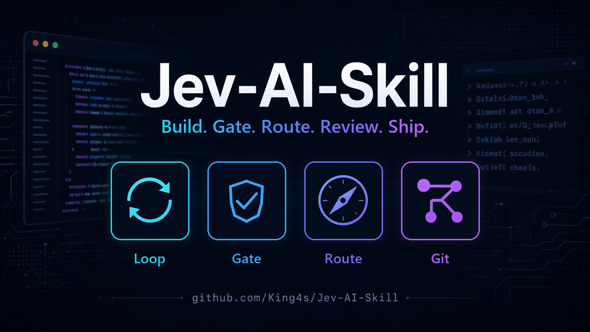

# Jev-AI-Skill



[](https://github.com/King4s/Jev-AI-Skill/actions/workflows/test.yml)

**One workflow for your AI coding tools: build, choose the right help, review and publish.**

Jev-AI-Skill brings three capabilities together in one reusable skill. Describe what you
want to achieve, and your AI assistant gets a structured way to work toward it, check the
result and prepare the next Git step. Jev, the decision model from TypeSafe System One,
provides judgments; your AI coding tool performs the work.

| Capability | What it does | Why it helps |
| --- | --- | --- |
| **Loop** | Turns a build or code-repair goal into execution steps, runs configured checks and requests independent review. | Completion depends on checks and a separate review, with saved state for resuming work. |
| **Route** | Chooses a model capability tier, a relevant installed skill and whether to delegate. | Routine tasks can use lighter models while harder work gets stronger help; actual cost and quality depend on the available models. |
| **Git** | Recommends commit, push or pull-request steps and applies repository rules. | Keeps publishing decisions tied to repository facts, review status and your authorization. |

## Why use it across AI tools?

Use the same goal, acceptance criteria and workflow whether you work in **Claude Code,
Codex or Hermes**. You can keep your preferred coding assistant while giving it a common
process for choosing help, checking progress and handing work to an independent reviewer.
The goal and run state live in files, so another configured client can resume the same
run when it has access to the same checkout and state. Conversation history is not
automatically transferred, and a run should have one active executor at a time.

Route works with capability tiers rather than hard-coded provider model IDs. The active
client maps those tiers to the models and delegation tools it actually exposes. This
lets the workflow travel between supported clients without prescribing one provider for
every task. Jev decisions still require a TypeSafe API key.

**Built-in installation currently supports Claude Code, Codex and Hermes.** Other AI
clients need support for the skill instructions, Python helpers, MCP and an independent
review mechanism, plus integration work. Compatibility with every AI app is not claimed.

For example, ask: “Build a CSV export for this project with Jev.” Loop coordinates the
work and checks, Route helps choose a suitable skill and model for each task, and an
independent reviewer evaluates the result. Git then recommends an authorized repository
step. You can also use Route or Git on their own.

For an existing codebase, ask: “Find where the old parser API is used, fix the calls
that are broken, and verify the behavior with Jev.” The coding assistant searches
and inspects the matches; Jev Loop coordinates the repair, checks and review. A
request to find locations only reports them without editing files.

The installed skill is named `jev`. The MCP server and its tools keep their existing
identity, `jev-loop` (`loop_start`, `loop_decide`, `loop_record_turn`,
`loop_record_review`, `loop_status`). Route and Git are Python helpers, not MCP tools.
Say `jev`, `jev-loop`, `jev-route` or `jev-git`; these legacy triggers use the same skill.
The installers migrate recognized old skill folders (`jev-loop`, `jev-route` and
`jev-git` where configured), removing a folder only when its frontmatter confirms that
exact legacy skill.

## Install

Requires Python 3.11+, at least one supported harness, and a TypeSafe API key. Set
`TYPESAFE_API_KEY` or store it in `~/.config/jev-loop/typesafe_api_key`.

```powershell
# Windows
git clone https://github.com/King4s/Jev-AI-Skill.git; cd Jev-AI-Skill; .\install.ps1
```

```bash
# Linux, macOS or WSL
git clone https://github.com/King4s/Jev-AI-Skill.git ~/Jev-AI-Skill && ~/Jev-AI-Skill/install.sh
```

On Windows, `install.ps1` always copies the skill to Claude Code's
`~/.claude/skills/jev/`; it registers Claude's MCP server only if `claude` is on PATH.
Codex and Hermes skill copies and MCP registration are conditional on their CLI being on
PATH. On Linux, macOS and WSL, `install.sh` conditionally copies the skill and registers
the server for each CLI it finds (`claude`, `codex`, `hermes`). The POSIX installer creates
a repository-local `.venv`; the Windows installer uses `python` from PATH. Both install
Python dependencies. Hermes uses `$HERMES_HOME` when set, otherwise `~/.hermes`, for its
skill, config and `.env` paths. Both installers run `jev_mcp.py --check` if a key is
available; otherwise they print a key warning and skip the live check. Restart the harness
or start a new session after setup. Run the installer again after `git pull` to update.

The key file can also be used by the helpers. In Hermes, the installer passes an
environment reference only when its `.env` contains a `TYPESAFE_API_KEY`; otherwise the
server reads the key file itself.

## Loop

Say what you want built, or invoke the `jev` skill (`/jev` in Claude Code, `$jev` or
`/skills` in Codex, or the harness's skill mechanism in Hermes). It gathers missing
requirements, drafts acceptance criteria, writes a goal JSON file and summarizes it. It
starts once the user has said to proceed, or directly when the user already asked it to
start. The harness follows Jev's role and brief, records each turn, and requests an
independent reviewer when Jev routes to review. The server runs configured checks and
records the run; only the reviewer can mark it complete.

```text
loop_start → loop_decide → execute → loop_record_turn → checks → loop_decide
                                      review → loop_record_review → execute or stop
```

The MCP tools are `loop_start(goal_path)`, `loop_decide(run_id)`,
`loop_record_turn(run_id, notes, files, executor_ok)`,
`loop_record_review(run_id, done, missing)` and `loop_status(run_id)`. A rejected review
returns the run to execution; record that turn before the next decision. An approved review
stops the run as complete.

Example requests include:

> Build with Jev: a small tool that renames my photos by capture date.

> Continue the existing goal in this folder and fix the failing checks.

The skill supports harness-specific tool names and workflows; question and delegation
facilities vary by harness. If an optional question or Route delegation tool is
unavailable, the skill uses a suitable chat or in-session fallback and states the
limitation. Loop always follows the MCP server protocol and obtains an independent review;
the executor cannot replace that review with its own verdict.

The goal file uses `goal`, `acceptance`, `workdir`, `checks`, `roles` and optional limits
such as `max_turns`, `max_consecutive_failures`, `check_timeout`, `stall_turns`,
`review_turns`, `jev_done_threshold` and `jev_review_threshold`; see
[goal.example.json](goal.example.json). Checks are shell commands run in
`workdir`. They may execute code on your machine. Jev receives the goal, acceptance
criteria, a limited project file list, check results and compact turn notes; it does not
read the implementation itself. A reviewer reads the work independently. Stalled or
unreviewed progress can be sent to review before Jev's done score crosses its threshold.
The server stores run state in `runs/<id>.state.json` and a decision tape in
`runs/<id>.jsonl`.

The separate legacy [loop.py](loop.py) script asks models through OpenRouter to execute
and review the goal. Its `executor_model` and `review_model` settings in the example goal
apply to that script; the MCP Loop uses the active harness for execution and review.

## Route

Route asks Jev to choose a capability tier, a relevant skill and whether to delegate. The
tiers `haiku`, `sonnet`, `opus` and `fable` describe relative capabilities; they are not
model IDs. Map the returned tier to a model actually available in the current harness.
When the chosen skill falls below the helper's confidence threshold, it returns `none`.
If a requested model or delegation feature is unavailable, the harness applies its
documented fallback.

Create a JSON request and pass its path to the installed helper:

```json
{
  "task": "Add CSV export and define done criteria",
  "context": "Keep the existing command-line interface",
  "skills": {"api-and-interface-design": "Design stable module interfaces"},
  "main_model": "sonnet",
  "review": false
}
```

```bash
python ~/.agents/skills/jev/route.py request.json
```

Use `main_model` as the main session's mapped capability tier. `review` must be a JSON
boolean; set it to `true` for an independent reviewer, which requires delegation and
raises its tier to at least the main session's tier. The output JSON includes `model`,
`skill`, `subagent`, `reason` and `raw` probability data. The helper makes the TypeSafe
request and returns a decision; it does not launch models or agents itself.

## Git

Git gathers repository facts, asks Jev for a next step, and applies hard blocks before
returning `action`, `blocked`, `commands`, `argv`, `reason`, `facts` and `raw` fields.
Preview facts and blocks without a TypeSafe call:

```bash
python ~/.agents/skills/jev/git_decide.py --repo . --summary "Feature is complete" --scan-only
```

For a Jev decision, include `--reviewed` only after independent review and
`--checks-green` only when checks for the current work pass:

```bash
python ~/.agents/skills/jev/git_decide.py --repo . --summary "Feature is complete" --reviewed --checks-green
```

The helper does not modify Git state. `commands` is display guidance only; use the
returned `argv` as argument vectors with shell execution disabled, after replacing its
placeholders. The harness executes only steps already within the user's authorization.
By default, direct publishing from `main` or `master` is blocked; pushes are blocked for
unsupported origin destinations, blocked commits, disallowed identities, matching private
patterns or suspected secrets. A pull request also requires both flags above, and an
outward step may be withheld when Jev says a user decision is needed.

The secret scan uses a small set of text patterns over added lines in outgoing commits,
merge-parent diffs and the working-tree diff, plus commit subjects. It is a heuristic and
cannot guarantee that secrets or private data are absent. Review outgoing changes yourself.
Private per-repository policies live outside the repository in
`~/.config/jev-git/policies/*.json`. They match the canonical origin remote exactly. If a
repository is renamed, update its configured origin URL and the policy's `remote` value
to the new matching remote while retaining the rest of the policy.

## Moving existing clones after the repository rename

The repository's canonical URL is `King4s/Jev-AI-Skill` (previously `jev-loop` and `jev`). Move
an existing clone to the new remote by updating its `origin`, pulling, and rerunning the
installer. The local directory may keep its old name; runtime identities such as the MCP
server and API key path remain `jev-loop`.

```bash
git remote set-url origin git@github.com:King4s/Jev-AI-Skill.git
git pull
./install.sh                 # Windows: .\install.ps1
```

## Development

See [AGENTS.md](AGENTS.md) for repository workflow and [CHANGELOG.md](CHANGELOG.md) for
release history. The helper modules use Python's standard library; the MCP server requires
the packages in `requirements.txt`. On Linux or macOS, run `pip install -r requirements.txt`
(Windows PowerShell: `python -m pip install -r requirements.txt`).

## Security

Checks run shell commands from the goal file, and the code they test may have been written
by a model. Treat goals and checks as executable code and use an isolated environment for
untrusted projects. The API key is read from the environment or key file; it is not written
to the repository or run tape.

## License

[MIT](LICENSE)
